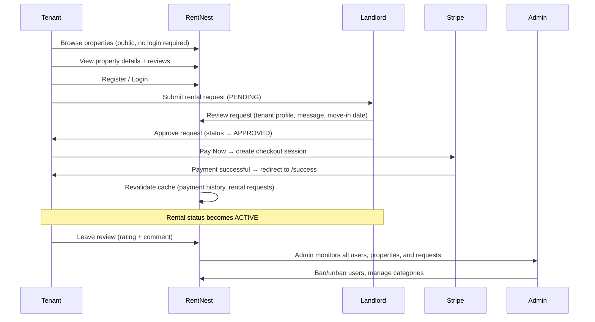
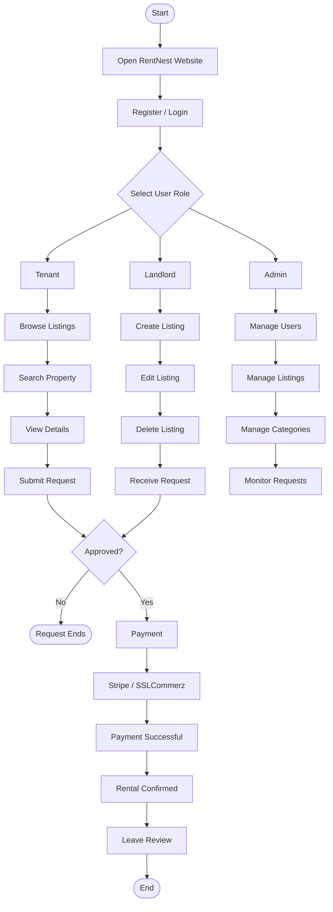

# API Integration — RentNest Frontend

This document maps every frontend component/server action to the backend API endpoint it consumes. Use it as a quick reference for what calls what.


## Project Overview

RentNest is a modern, responsive **Next.js application** for a rental property marketplace. Landlords can list properties, manage availability, and approve or reject rental requests via an intuitive dashboard. Tenants can browse listings with advanced filtering, submit rental requests, and complete secure payments. Admins oversee the entire platform through a comprehensive moderation dashboard. 

---

## Roles & Permissions

| Role | Description | Frontend UI Expectations |
|------|-------------|-----------------|
| **Tenant** | Users looking for rental properties | Public browsing, interactive request forms, payment checkout flow, review submission, protected tenant dashboard. |
| **Landlord** | Property owners who list rentals | Protected landlord dashboard, property CRUD forms (with image upload UI), request approval/rejection toggles, tenant history views. |
| **Admin** | Platform moderators | Protected admin dashboard, user management tables (ban/unban actions), global platform statistics, content moderation UI. |

> 💡 **Note**: Users select their role during registration. The UI must dynamically adapt based on the authenticated user's role, and routes must be protected using **Next.js Middleware**.

---

## Features & UI/UX 

### Public Features
- **Responsive Property Grid**: Display properties with optimized images (`next/image`), price, location, and basic amenities.
- **Advanced Search & Filter**: Sidebar or top-bar filters for location, price range, property type, and amenities with real-time UI updates.
- **Property Details Page**: Comprehensive view with image gallery, description, landlord info, and a "Request to Rent" call-to-action (CTA).
- **Loading & Error States**: Skeleton loaders for data fetching and graceful `error.tsx` fallbacks.

### Tenant Features
- **Auth Flows**: Registration and login forms with validation error messages.
- **Rental Request Flow**: Interactive form/modal to submit a request. If approved, a clear "Proceed to Payment" CTA.
- **Payment Integration**: Seamless redirect to **Stripe Checkout** or **SSLCommerz** gateway. Dedicated `/payment/success` and `/payment/cancel` pages with clear UI feedback.
- **Tenant Dashboard**: View rental request history (with status badges: Pending, Approved, Rejected, Active), payment history table, and a form to leave reviews after completion.

### Landlord Features
- **Landlord Dashboard**: Overview of total properties, active requests, and earnings.
- **Property Management**: Forms to create, edit, and remove listings. Include UI for image URL uploads and availability toggles.
- **Request Management**: A dedicated table/list to view incoming requests with "Approve" and "Reject" action buttons (triggering toast notifications on success).

### Admin Features
- **Admin Dashboard**: Global overview of platform health (total users, properties, pending requests).
- **User Management**: Data table of all users with search, pagination, and "Ban/Unban" action buttons.
- **Content Moderation**: Views to inspect all listings and rental requests across the platform.

---

## Frontend Routes & API Integration

---

## 🏠 Public — Properties & Categories

| Frontend Component | Server Action | Backend Endpoint | Method |
|---|---|---|---|
| `PropertyList` (Home page) | `getHouseRentalProperties` | `/api/properties` | GET |
| `PropertyDetails` | `getPropertyById` | `/api/properties/:propertyId` | GET |
| `PropertyReviews` | `getPropertyReviews` | `/api/review/:propertyId` | GET |
| `CreatePropertyForm` (category dropdown) | `getCategories` | `/api/categories` | GET |

---

## 🏘️ Landlord — Property Management

| Frontend Component | Server Action | Backend Endpoint | Method |
|---|---|---|---|
| `MyPropertiesList` | `getMyProperties` | `/api/properties/landlord` | GET |
| `CreatePropertyForm` | `createProperty` | `/api/properties/landlord` | POST |
| `PropertyFormDialog` (edit mode) | `updateProperty` | `/api/properties/landlord/:id` | PUT |
| `DeletePropertyDialog` | `deleteProperty` | `/api/properties/landlord/:id` | DELETE |

---

## 📋 Rental Requests

| Frontend Component | Server Action | Backend Endpoint | Method |
|---|---|---|---|
| `RequestRentalDialog` (tenant, on property details page) | `createRentalRequest` | `/api/rentals` | POST |
| `RentalRequestsList` (landlord — all requests on their properties) | `getRentalRequests` | `/api/rentals` | GET |
| `MyRentalRequestsList` (tenant — their own requests) | `getMyRentalRequests` | `/api/rentals` | GET |
| `AdminRentalRequestsList` (admin — platform-wide moderation) | `getAllRentalRequests` | `/api/rentals` | GET |
| `RentalRequestCard` (landlord Accept/Reject buttons) | `updateRentalStatus` | `/api/rentals/:id/status` | PUT |

> Status flow: `PENDING → APPROVED / REJECTED → ACTIVE → COMPLETED`
> UI badge colors (via `getStatusBadgeClass`): Pending = yellow, Approved = blue, Rejected = red, Active = green, Completed = gray.

---

## 💳 Payments

| Frontend Component | Server Action | Backend Endpoint | Method |
|---|---|---|---|
| `PayNowButton` | `createCheckoutSession` | `/api/pay/create-checkout-session` | POST |
| `TenantPaymentsList` / `PaymentHistoryTable` | `getPaymentHistory` | `/api/pay` | GET |
| `/success` page | `confirmPaymentSuccess` (revalidates cache after Stripe redirect) | — (internal cache revalidation only) | — |

> Stripe redirects to `/success` or `/cancel` after checkout, based on `success_url`/`cancel_url` set by the backend.

---

## ⭐ Reviews

| Frontend Component | Server Action | Backend Endpoint | Method |
|---|---|---|---|
| `WriteReviewDialog` (tenant, shown on `ACTIVE` requests) | `createReview` | `/api/review` | POST |
| `PropertyReviews` (public property details page) | `getPropertyReviews` | `/api/review/:propertyId` | GET |
| `MyReviewsPage` (tenant dashboard) | `getTenantReviews` | `/api/review/tenant-reviews` | GET |

---

## 🔐 Authentication & Profile

| Frontend Component | Server Action | Backend Endpoint | Method |
|---|---|---|---|
| `RegisterForm` | `registerAction` | `/api/users/register` | POST |
| `LoginForm` | `loginAction` | `/api/auth/login` | POST |
| `Navbar`, `DashboardGroupLayout`, `PublicGroupLayout` (get current user) | `getMe` | `/api/users/me` | GET |
| `getAccessToken` (internal, called by nearly every action) | `getNewAccessToken` | `/api/auth/refresh-token` | POST |
| `ProfileForm` (Tenant / Landlord / Admin — shared component) | `updateProfile` | `/api/users/updateProfile` | PUT |
| `Navbar` logout menu item | `logout` | `/api/auth/logout` | POST |

> `getAccessToken` is a shared utility: checks if the access token is valid, and silently refreshes it via the refresh token if expired — used internally by nearly all server actions above instead of reading cookies directly.

---

## 🛠️ Admin

| Frontend Component | Server Action | Backend Endpoint | Method |
|---|---|---|---|
| `AdminDashboardPage` | `getAdminDashboard` | `/api/admin/dashboard` | GET |
| `UsersList` / `UsersTable` | `getAllUsers` | `/api/admin/allusers` | GET |
| `UserRow` (Ban / Unban toggle) | `updateUserStatus` | `/api/admin/user/:id/status` | PATCH |
| `UserRow` (Delete) | `deleteUser` | `/api/admin/user/:id` | DELETE |
| `CategoriesList` | `getAllCategories` | `/api/categories` | GET |
| `CategoryFormDialog` (create mode) | `createCategory` | `/api/categories` | POST |
| `CategoryFormDialog` (edit mode) | `updateCategory` | `/api/categories/:id` | PUT |
| `DeleteCategoryDialog` | `deleteCategory` | `/api/categories/:id` | DELETE |
| `AllPropertiesList` (admin — platform-wide, read-only) | `getHouseRentalProperties` (reused public action) | `/api/properties` | GET |

---

## 🖼️ Image Uploads (Third-Party — ImgBB)

| Frontend Component | Internal Route | External Service | Method |
|---|---|---|---|
| `RegisterForm` (optional profile photo) | `/api/upload-image` (own Next.js API route, proxies to ImgBB) | ImgBB API | POST |
| `ProfileForm` (update profile photo) | `/api/upload-image` | ImgBB API | POST |
| `CreatePropertyForm` (multiple property images) | `/api/upload-image` | ImgBB API | POST |

> Images are uploaded directly from the browser to `/api/upload-image`, which securely proxies the request to ImgBB (keeping the API key server-side), then returns a public URL that gets submitted as part of the form data (`property_image`, `photo`).

---

## 📌 Notes on Caching Strategy

| Data Type | Strategy | Reasoning |
|---|---|---|
| Properties, categories | `revalidate: 60`, tagged | Changes occasionally; short cache is fine |
| Rental requests, payment history | `cache: "no-store"` | Must always reflect real-time status (payments, approvals) |
| User profile (`getMe`) | `cache: "no-store"` | Must always reflect the currently logged-in user, never cached/shared across visitors |
| Reviews | Tagged (`property-reviews-:id`, `tenant-reviews`) | Revalidated on-demand via `revalidateTag` after a new review is submitted |

All mutating actions (`create`/`update`/`delete`) call `revalidateTag(...)` on success to invalidate the relevant cached reads, so the UI reflects changes without requiring a manual refresh.

---

## 📊 Flow Diagrams

### 📜 Sequence Diagram

This shows the same flow as a timeline of messages between the tenant, the platform, the landlord, the payment gateway, and the admin.



[⬆ Back to top](#api-integration--rentnest-frontend)

---

### 🌐 Website Flowchart

This is the full site-level flow, showing what each role can do after logging in, and how a rental request moves through its actual status lifecycle.

This is the full site-level flow, showing what each role can do after logging in.




### 🏠 Tenant Journey
```text
[Register/Login] → [Browse Properties] → [View Details] 
       ↓
[Submit Request Form (Validation)] → [Wait for Approval UI]
       ↓
[Approved: "Pay Now" CTA] → [Stripe/SSLCommerz Redirect]
       ↓
[Payment Success Page] → [Leave Review Form]


### 🏘️ Landlord Journey
```text
[Register/Login] → [Dashboard Overview] → [Create Listing Form]
       ↓
[View Incoming Requests Table] → [Click Approve/Reject]
       ↓
[Toast Notification: "Request Approved"] → [Tenant can now pay]

### 🏘️ Admin Journey


### 📊 Rental Request Status (UI Badges)
- `PENDING` → Yellow/Orange Badge
- `APPROVED` → Blue Badge (Shows "Pay Now" button)
- `REJECTED` → Red Badge
- `ACTIVE` → Green Badge (Shows "Leave Review" button)
- `COMPLETED` → Gray Badge

[⬆ Back to top](#api-integration--rentnest-frontend)
