# 🏠 RentNest — Frontend

A modern, responsive **Next.js** rental property marketplace. Landlords list and manage properties, tenants browse and rent with secure payments, and admins moderate the whole platform — all through role-based dashboards.

[](https://rentnest-frontend-theta.vercel.app)
[](https://rentnestbackend.vercel.app)

---


# RentNest — Full Workflow

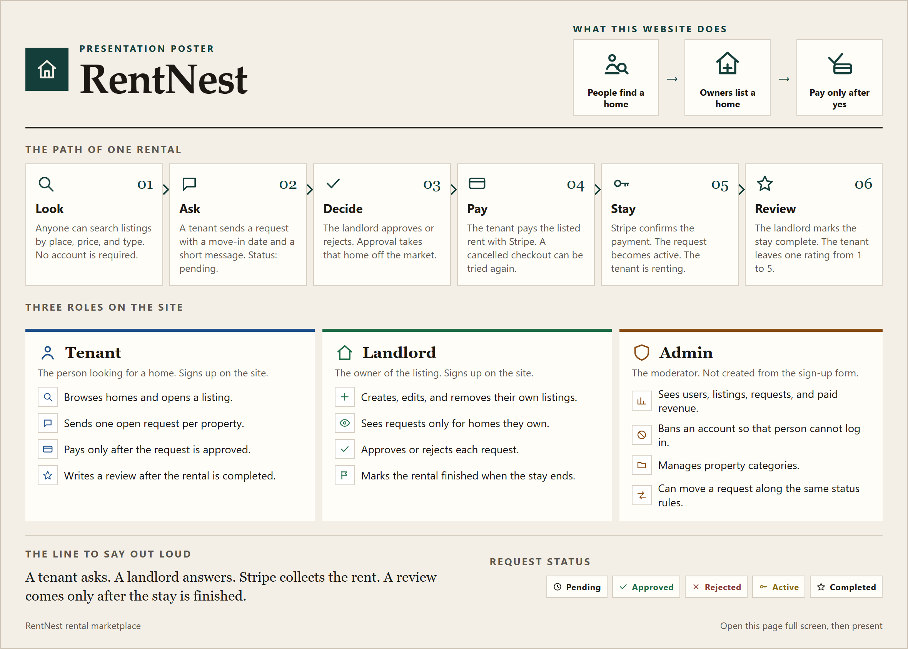

RentNest is a rental marketplace. Visitors browse listings. A **tenant** requests a property, a **landlord** approves or rejects it, the tenant pays with Stripe, and an **admin** moderates users, categories, listings, and requests.

Roles in the database: `TENANT`, `LANDLORD`, `ADMIN`.
Registration only allows `TENANT` or `LANDLORD`. Admin accounts are created directly in the database.


## 1. One-look system flow

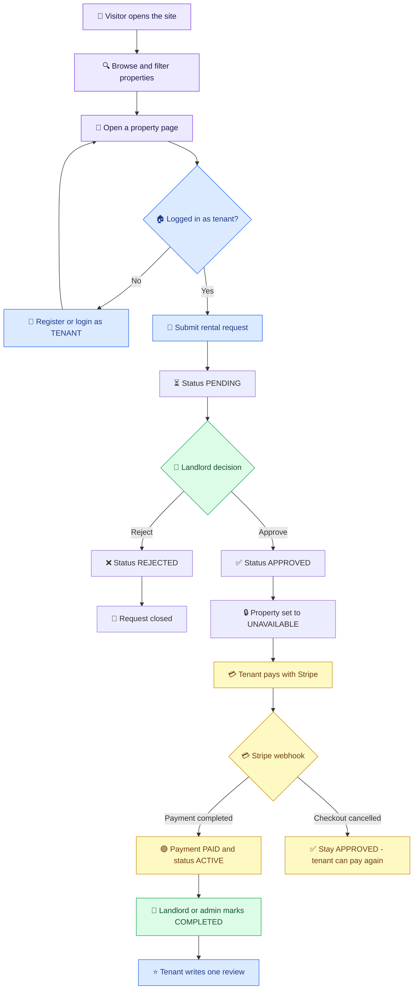
```mermaid
flowchart TD
    A["👀 Visitor opens the site"] --> B["🔍 Browse and filter properties"]
    B --> C["🏢 Open a property page"]
    C --> D{"🏠 Logged in as tenant?"}
    D -- No --> E["🔐 Register or login as TENANT"]
    E --> C
    D -- Yes --> F["📝 Submit rental request"]
    F --> G["⏳ Status PENDING"]
    G --> H{"🔑 Landlord decision"}
    H -- Reject --> I["❌ Status REJECTED"]
    I --> Z["🚫 Request closed"]
    H -- Approve --> J["✅ Status APPROVED"]
    J --> K["🔒 Property set to UNAVAILABLE"]
    K --> L["💳 Tenant pays with Stripe"]
    L --> M{"💳 Stripe webhook"}
    M -- Payment completed --> N["🟢 Payment PAID and status ACTIVE"]
    M -- Checkout cancelled --> O["✅ Stay APPROVED - tenant can pay again"]
    N --> P["🏁 Landlord or admin marks COMPLETED"]
    P --> Q["⭐ Tenant writes one review"]

    classDef visitor fill:#ede9fe,stroke:#7c3aed,color:#1e1b4b
    classDef tenant fill:#dbeafe,stroke:#2563eb,color:#1e3a8a
    classDef landlord fill:#dcfce7,stroke:#16a34a,color:#14532d
    classDef pay fill:#fef9c3,stroke:#ca8a04,color:#713f12
    class A,B,C visitor
    class D,E,F,Q tenant
    class H,P landlord
    class L,M,N,O pay
```

---

## 2. How the three roles meet on one rental

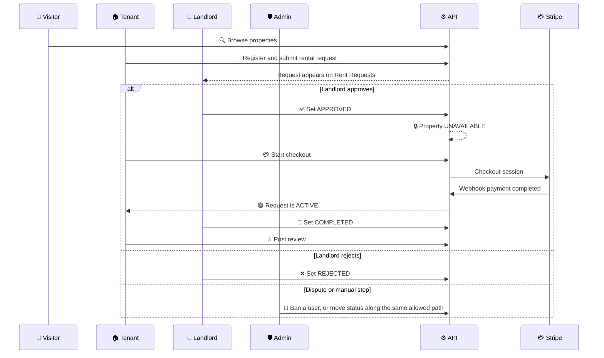
```mermaid
sequenceDiagram
    participant V as 👀 Visitor
    participant T as 🏠 Tenant
    participant L as 🔑 Landlord
    participant A as 🛡️ Admin
    participant API as ⚙️ API
    participant S as 💳 Stripe

    V->>API: 🔍 Browse properties
    T->>API: 📝 Register and submit rental request
    API-->>L: Request appears on Rent Requests
    alt Landlord approves
        L->>API: ✅ Set APPROVED
        API-->>API: 🔒 Property UNAVAILABLE
        T->>API: 💳 Start checkout
        API->>S: Checkout session
        S->>API: Webhook payment completed
        API-->>T: 🟢 Request is ACTIVE
        L->>API: 🏁 Set COMPLETED
        T->>API: ⭐ Post review
    else Landlord rejects
        L->>API: ❌ Set REJECTED
    else Dispute or manual step
        A->>API: 🚫 Ban a user, or move status along the same allowed path
    end
```

---

## 3. Rental status machine

These are the only transitions the API allows (`ALLOWED_TRANSITIONS` in the rental service). `REJECTED` and `COMPLETED` cannot move again.

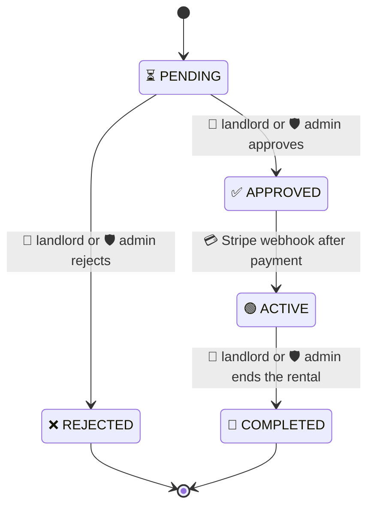
```mermaid
stateDiagram-v2
    [*] --> PENDING
    state "⏳ PENDING" as PENDING
    state "✅ APPROVED" as APPROVED
    state "❌ REJECTED" as REJECTED
    state "🟢 ACTIVE" as ACTIVE
    state "🏁 COMPLETED" as COMPLETED
    PENDING --> APPROVED: 🔑 landlord or 🛡️ admin approves
    PENDING --> REJECTED: 🔑 landlord or 🛡️ admin rejects
    APPROVED --> ACTIVE: 💳 Stripe webhook after payment
    ACTIVE --> COMPLETED: 🔑 landlord or 🛡️ admin ends the rental
    REJECTED --> [*]
    COMPLETED --> [*]
```

What each status means:

| Status | Meaning | Who moves it |
|---|---|---|
| ⏳ `PENDING` | Request sent, waiting for a decision | Created by the tenant |
| ✅ `APPROVED` | Landlord accepted. Property is taken off the market | Landlord or admin |
| ❌ `REJECTED` | Landlord declined. Terminal | Landlord or admin |
| 🟢 `ACTIVE` | Stripe payment recorded. Tenant is renting | Stripe webhook (`checkout.session.completed`) |
| 🏁 `COMPLETED` | Rental finished. Review is now allowed | Landlord or admin |

Approving a request sets that property’s `availability` to `UNAVAILABLE`, so it cannot be requested again while the booking is open.

A tenant cannot submit a second request for the same property while one is already `PENDING`, `APPROVED`, or `ACTIVE`.

---

## 4. Public user flow

Anyone can use the public site without an account.

Pages: `/` (home and listings), `/propertiesDetails/[id]`, `/about`, `/services`, `/contact`, `/success`, `/cancel`.

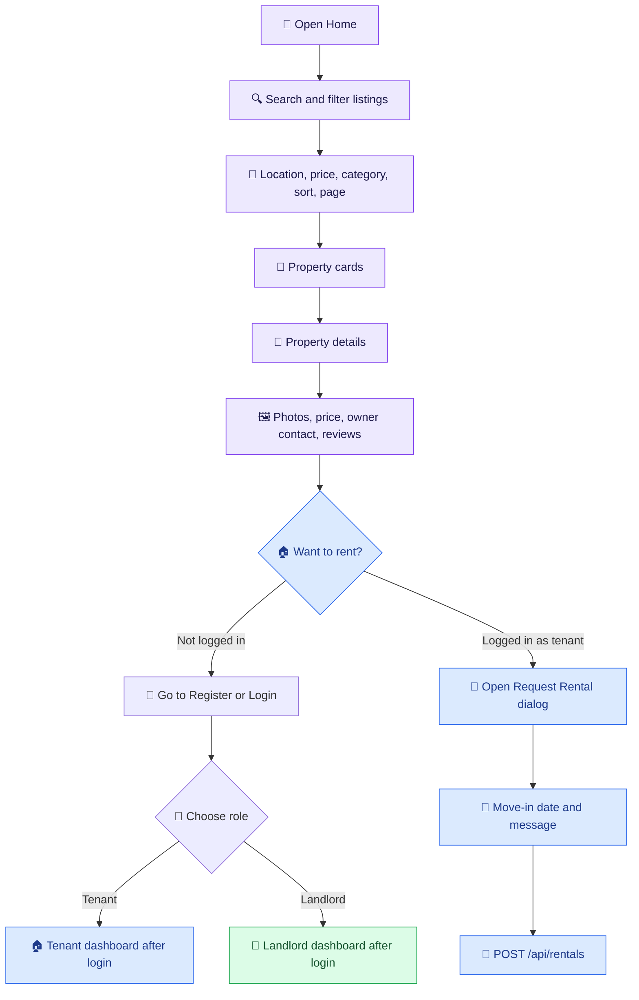
```mermaid
flowchart TD
    A["👀 Open Home"] --> B["🔍 Search and filter listings"]
    B --> C["📍 Location, price, category, sort, page"]
    C --> D["🏢 Property cards"]
    D --> E["🏢 Property details"]
    E --> F["🖼️ Photos, price, owner contact, reviews"]
    F --> G{"🏠 Want to rent?"}
    G -- Not logged in --> H["🔐 Go to Register or Login"]
    G -- Logged in as tenant --> I["📝 Open Request Rental dialog"]
    I --> J["📅 Move-in date and message"]
    J --> K["📝 POST /api/rentals"]
    H --> L{"🔐 Choose role"}
    L -- Tenant --> M["🏠 Tenant dashboard after login"]
    L -- Landlord --> N["🔑 Landlord dashboard after login"]

    classDef visitor fill:#ede9fe,stroke:#7c3aed,color:#1e1b4b
    classDef tenant fill:#dbeafe,stroke:#2563eb,color:#1e3a8a
    classDef landlord fill:#dcfce7,stroke:#16a34a,color:#14532d
    class A,B,C,D,E,F visitor
    class G,I,J,K,M tenant
    class N landlord
```

Public property search uses `GET /api/properties` with `location`, `minPrice`, `maxPrice`, `category`, `sort` (`price_asc` / `price_desc`), `page`, and `limit`.

---

## 5. Shared account flow

Every logged-in person shares the same account steps. The navbar then sends them to the dashboard that matches their role.

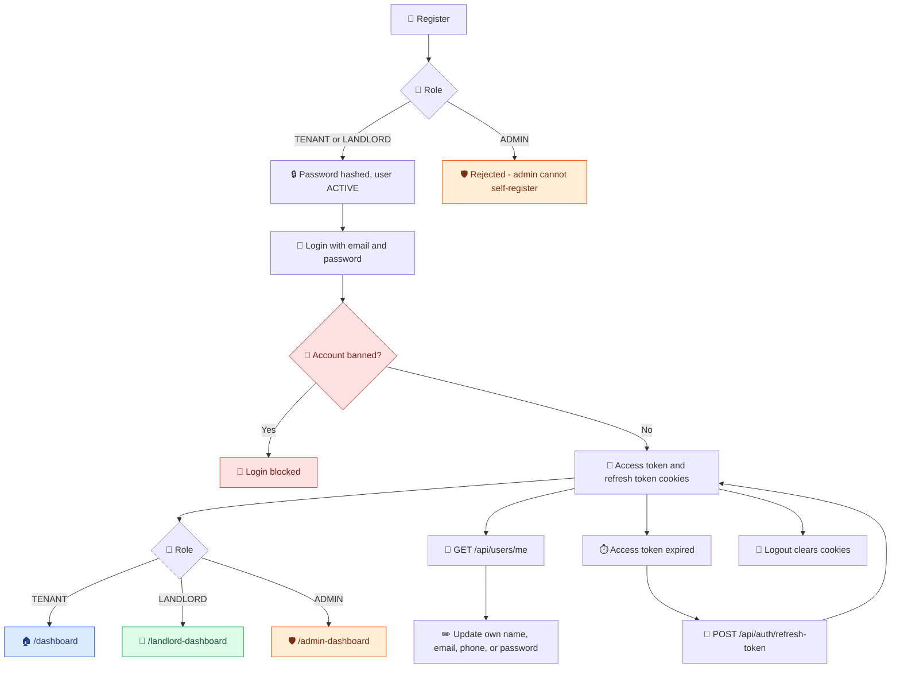
```mermaid
flowchart TD
    A["🔐 Register"] --> B{"🔐 Role"}
    B -- TENANT or LANDLORD --> C["🔒 Password hashed, user ACTIVE"]
    B -- ADMIN --> X["🛡️ Rejected - admin cannot self-register"]
    C --> D["🔐 Login with email and password"]
    D --> E{"🚫 Account banned?"}
    E -- Yes --> F["🚫 Login blocked"]
    E -- No --> G["🍪 Access token and refresh token cookies"]
    G --> H{"🔐 Role"}
    H -- TENANT --> I["🏠 /dashboard"]
    H -- LANDLORD --> J["🔑 /landlord-dashboard"]
    H -- ADMIN --> K["🛡️ /admin-dashboard"]
    G --> L["👤 GET /api/users/me"]
    L --> M["✏️ Update own name, email, phone, or password"]
    G --> N["⏱️ Access token expired"]
    N --> O["🔄 POST /api/auth/refresh-token"]
    O --> G
    G --> P["🚪 Logout clears cookies"]

    classDef tenant fill:#dbeafe,stroke:#2563eb,color:#1e3a8a
    classDef landlord fill:#dcfce7,stroke:#16a34a,color:#14532d
    classDef admin fill:#ffedd5,stroke:#ea580c,color:#7c2d12
    classDef blocked fill:#fee2e2,stroke:#dc2626,color:#7f1d1d
    class I tenant
    class J landlord
    class K,X admin
    class E,F blocked
```

Dashboard pages require a valid session. If `GET /api/users/me` fails, the layout redirects to `/login`.

---

## 6. Tenant flow

Sidebar: Dashboard, Profile, My Requests, Payments, My Reviews, Rent a House.

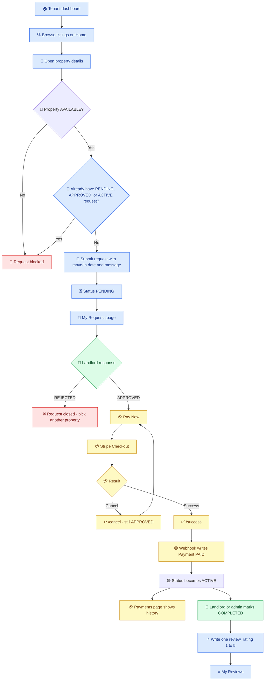
```mermaid
flowchart TD
    A["🏠 Tenant dashboard"] --> B["🔍 Browse listings on Home"]
    B --> C["🏢 Open property details"]
    C --> D{"🏢 Property AVAILABLE?"}
    D -- No --> E["🚫 Request blocked"]
    D -- Yes --> F{"📝 Already have PENDING, APPROVED, or ACTIVE request?"}
    F -- Yes --> E
    F -- No --> G["📝 Submit request with move-in date and message"]
    G --> H["⏳ Status PENDING"]
    H --> I["📝 My Requests page"]
    I --> J{"🔑 Landlord response"}
    J -- REJECTED --> K["❌ Request closed - pick another property"]
    J -- APPROVED --> L["💳 Pay Now"]
    L --> M["💳 Stripe Checkout"]
    M --> N{"💳 Result"}
    N -- Cancel --> O["↩️ /cancel - still APPROVED"]
    O --> L
    N -- Success --> P["✅ /success"]
    P --> Q["🟢 Webhook writes Payment PAID"]
    Q --> R["🟢 Status becomes ACTIVE"]
    R --> S["💳 Payments page shows history"]
    R --> T["🏁 Landlord or admin marks COMPLETED"]
    T --> U["⭐ Write one review, rating 1 to 5"]
    U --> V["⭐ My Reviews"]

    classDef tenant fill:#dbeafe,stroke:#2563eb,color:#1e3a8a
    classDef landlord fill:#dcfce7,stroke:#16a34a,color:#14532d
    classDef pay fill:#fef9c3,stroke:#ca8a04,color:#713f12
    classDef blocked fill:#fee2e2,stroke:#dc2626,color:#7f1d1d
    class A,B,C,F,G,H,I,U,V tenant
    class J,T landlord
    class L,M,N,O,P,Q,S pay
    class E,K blocked
```

Tenant rules from the API:

- Can only pay a request that is `APPROVED` and that they submitted.
- Checkout amount is the property `rentPrice` in USD cents.
- A review is allowed only when the request is `COMPLETED`, the request belongs to that tenant, and that request has no review yet.
- One review per rental request, and one review per tenant per property.

### Tenant payment sequence

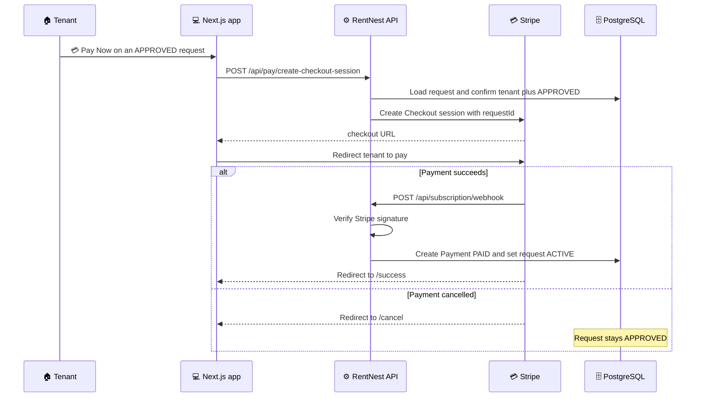
```mermaid
sequenceDiagram
    participant T as 🏠 Tenant
    participant Web as 💻 Next.js app
    participant API as ⚙️ RentNest API
    participant S as 💳 Stripe
    participant DB as 🗄️ PostgreSQL

    T->>Web: 💳 Pay Now on an APPROVED request
    Web->>API: POST /api/pay/create-checkout-session
    API->>DB: Load request and confirm tenant plus APPROVED
    API->>S: Create Checkout session with requestId
    S-->>Web: checkout URL
    Web->>S: Redirect tenant to pay
    alt Payment succeeds
        S->>API: POST /api/subscription/webhook
        API->>API: Verify Stripe signature
        API->>DB: Create Payment PAID and set request ACTIVE
        S-->>Web: Redirect to /success
    else Payment cancelled
        S-->>Web: Redirect to /cancel
        Note over DB: Request stays APPROVED
    end
```

---

## 7. Landlord flow

The landlord is the property owner. Sidebar: Dashboard, Profile, My Properties, Add Property, Rent Requests.

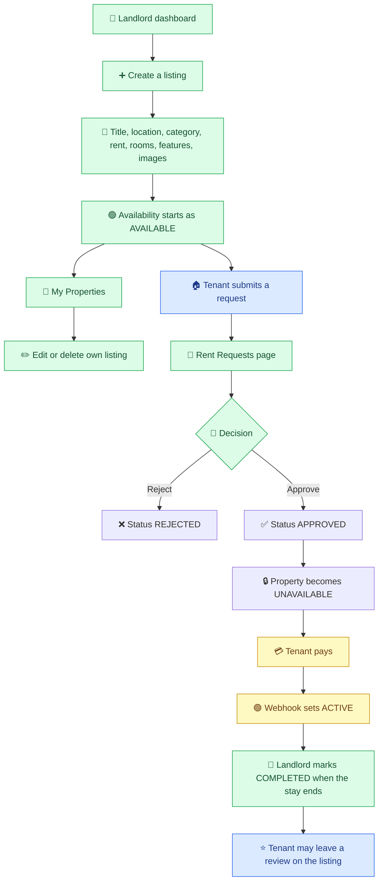
```mermaid
flowchart TD
    A["🔑 Landlord dashboard"] --> B["➕ Create a listing"]
    B --> C["🏢 Title, location, category, rent, rooms, features, images"]
    C --> D["🟢 Availability starts as AVAILABLE"]
    D --> E["🏢 My Properties"]
    E --> F["✏️ Edit or delete own listing"]
    D --> G["🏠 Tenant submits a request"]
    G --> H["📝 Rent Requests page"]
    H --> I{"🔑 Decision"}
    I -- Reject --> J["❌ Status REJECTED"]
    I -- Approve --> K["✅ Status APPROVED"]
    K --> L["🔒 Property becomes UNAVAILABLE"]
    L --> M["💳 Tenant pays"]
    M --> N["🟢 Webhook sets ACTIVE"]
    N --> O["🏁 Landlord marks COMPLETED when the stay ends"]
    O --> P["⭐ Tenant may leave a review on the listing"]

    classDef tenant fill:#dbeafe,stroke:#2563eb,color:#1e3a8a
    classDef landlord fill:#dcfce7,stroke:#16a34a,color:#14532d
    classDef pay fill:#fef9c3,stroke:#ca8a04,color:#713f12
    class A,B,C,D,E,F,H,I,O landlord
    class G,P tenant
    class M,N pay
```

A landlord only sees requests for properties they own. Updating another landlord’s request fails the ownership check.

Landlord property routes:

| Action | Route |
|---|---|
| Create listing | `POST /api/properties/landlord` |
| Update own listing | `PUT /api/properties/landlord/:id` |
| Delete own listing | `DELETE /api/properties/landlord/:id` |
| List own listings | `GET /api/properties/my-properties` |
| Change request status | `PUT /api/rentals/:id/status` |

---

## 8. Admin flow

Admin accounts are not created from the register form. Sidebar: Dashboard, Profile, Users, Categories, All Properties, Rental Requests.

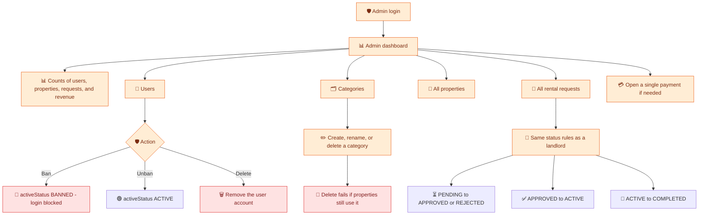
```mermaid
flowchart TD
    A["🛡️ Admin login"] --> B["📊 Admin dashboard"]
    B --> C["📊 Counts of users, properties, requests, and revenue"]
    B --> D["👥 Users"]
    D --> E{"🛡️ Action"}
    E -- Ban --> F["🚫 activeStatus BANNED - login blocked"]
    E -- Unban --> G["🟢 activeStatus ACTIVE"]
    E -- Delete --> H["🗑️ Remove the user account"]
    B --> I["🗂️ Categories"]
    I --> J["✏️ Create, rename, or delete a category"]
    J --> K["🚫 Delete fails if properties still use it"]
    B --> L["🏢 All properties"]
    B --> M["📝 All rental requests"]
    M --> N["🔑 Same status rules as a landlord"]
    N --> O["⏳ PENDING to APPROVED or REJECTED"]
    N --> P["✅ APPROVED to ACTIVE"]
    N --> Q["🏁 ACTIVE to COMPLETED"]
    B --> R["💳 Open a single payment if needed"]

    classDef admin fill:#ffedd5,stroke:#ea580c,color:#7c2d12
    classDef blocked fill:#fee2e2,stroke:#dc2626,color:#7f1d1d
    class A,B,C,D,E,I,J,L,M,N,R admin
    class F,H,K blocked
```

Admin dashboard numbers come from `GET /api/admin/dashboard`:

- Users: total, tenants, landlords
- Properties: total, available, rented (`UNAVAILABLE`)
- Requests: total, pending, approved
- Payments: count, and sum of amounts where status is `PAID`

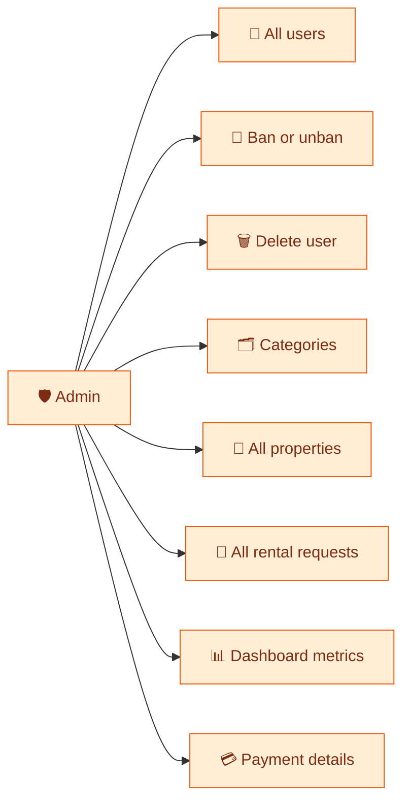
```mermaid
flowchart LR
    A["🛡️ Admin"] --> B["👥 All users"]
    A --> C["🚫 Ban or unban"]
    A --> D["🗑️ Delete user"]
    A --> E["🗂️ Categories"]
    A --> F["🏢 All properties"]
    A --> G["📝 All rental requests"]
    A --> H["📊 Dashboard metrics"]
    A --> I["💳 Payment details"]

    classDef admin fill:#ffedd5,stroke:#ea580c,color:#7c2d12
    class A,B,C,D,E,F,G,H,I admin
```

---

## 9. Data model

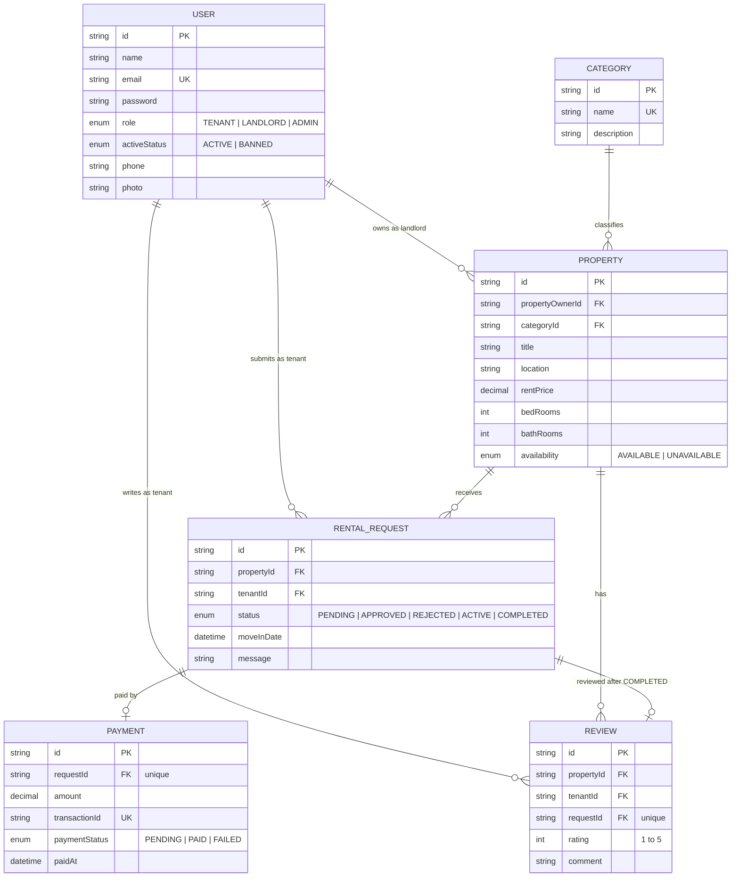
```mermaid
erDiagram
    USER ||--o{ PROPERTY : "owns as landlord"
    USER ||--o{ RENTAL_REQUEST : "submits as tenant"
    USER ||--o{ REVIEW : "writes as tenant"
    CATEGORY ||--o{ PROPERTY : classifies
    PROPERTY ||--o{ RENTAL_REQUEST : receives
    PROPERTY ||--o{ REVIEW : has
    RENTAL_REQUEST ||--o| PAYMENT : "paid by"
    RENTAL_REQUEST ||--o| REVIEW : "reviewed after COMPLETED"

    USER {
        string id PK
        string name
        string email UK
        string password
        enum role "TENANT | LANDLORD | ADMIN"
        enum activeStatus "ACTIVE | BANNED"
        string phone
        string photo
    }

    CATEGORY {
        string id PK
        string name UK
        string description
    }

    PROPERTY {
        string id PK
        string propertyOwnerId FK
        string categoryId FK
        string title
        string location
        decimal rentPrice
        int bedRooms
        int bathRooms
        enum availability "AVAILABLE | UNAVAILABLE"
    }

    RENTAL_REQUEST {
        string id PK
        string propertyId FK
        string tenantId FK
        enum status "PENDING | APPROVED | REJECTED | ACTIVE | COMPLETED"
        datetime moveInDate
        string message
    }

    PAYMENT {
        string id PK
        string requestId FK "unique"
        decimal amount
        string transactionId UK
        enum paymentStatus "PENDING | PAID | FAILED"
        datetime paidAt
    }

    REVIEW {
        string id PK
        string propertyId FK
        string tenantId FK
        string requestId FK "unique"
        int rating "1 to 5"
        string comment
    }
```

---

## 10. Where each role can go

| Step | 👀 Public visitor | 🏠 Tenant | 🔑 Landlord | 🛡️ Admin |
|---|:---:|:---:|:---:|:---:|
| Browse and search listings | Yes | Yes | Yes | Yes |
| Register from the site | Yes, as tenant or landlord | — | — | No |
| Submit a rental request | No | Yes | No | No |
| Approve or reject a request | No | No | Own properties | Any request |
| Pay with Stripe | No | Own approved request | No | No |
| Mark a rental completed | No | No | Own properties | Any request |
| Write a review | No | After COMPLETED | No | No |
| Create and edit listings | No | No | Own listings | Can use landlord routes |
| Ban or delete users | No | No | No | Yes |
| Manage categories | No | No | No | Yes |
| See platform revenue | No | No | No | Yes |

---

## 11. Screen map

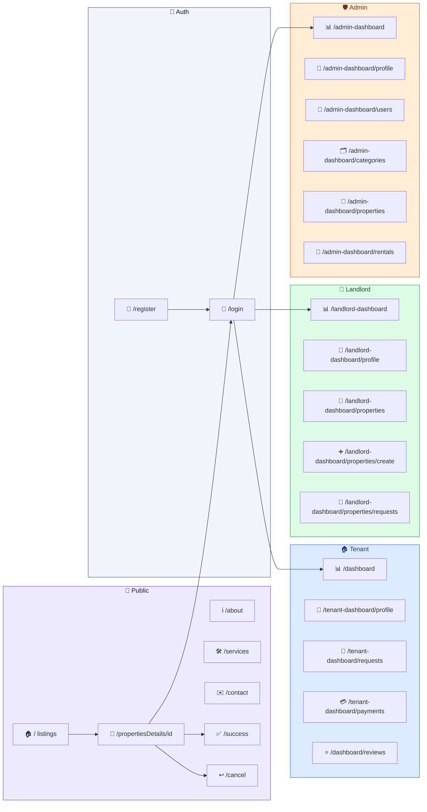
```mermaid
flowchart LR
    subgraph pub ["👀 Public"]
        Home["🏠 / listings"]
        Details["🏢 /propertiesDetails/id"]
        About["ℹ️ /about"]
        Services["🛠️ /services"]
        Contact["✉️ /contact"]
        Success["✅ /success"]
        Cancel["↩️ /cancel"]
    end

    subgraph auth ["🔐 Auth"]
        Login["🔐 /login"]
        Register["📝 /register"]
    end

    subgraph tenant ["🏠 Tenant"]
        TD["📊 /dashboard"]
        TP["👤 /tenant-dashboard/profile"]
        TR["📝 /tenant-dashboard/requests"]
        TPay["💳 /tenant-dashboard/payments"]
        TRev["⭐ /dashboard/reviews"]
    end

    subgraph landlord ["🔑 Landlord"]
        LD["📊 /landlord-dashboard"]
        LP["👤 /landlord-dashboard/profile"]
        LList["🏢 /landlord-dashboard/properties"]
        LAdd["➕ /landlord-dashboard/properties/create"]
        LReq["📝 /landlord-dashboard/properties/requests"]
    end

    subgraph admin ["🛡️ Admin"]
        AD["📊 /admin-dashboard"]
        AP["👤 /admin-dashboard/profile"]
        AU["👥 /admin-dashboard/users"]
        AC["🗂️ /admin-dashboard/categories"]
        AProp["🏢 /admin-dashboard/properties"]
        AR["📝 /admin-dashboard/rentals"]
    end

    Home --> Details
    Details --> Login
    Register --> Login
    Login --> TD
    Login --> LD
    Login --> AD
    Details --> Success
    Details --> Cancel

    style pub fill:#ede9fe,stroke:#7c3aed,color:#1e1b4b
    style auth fill:#f1f5f9,stroke:#475569,color:#0f172a
    style tenant fill:#dbeafe,stroke:#2563eb,color:#1e3a8a
    style landlord fill:#dcfce7,stroke:#16a34a,color:#14532d
    style admin fill:#ffedd5,stroke:#ea580c,color:#7c2d12
```

Open this file in a Markdown preview that supports Mermaid (Cursor, GitHub, or VS Code with a Mermaid extension) to see the diagrams rendered.


## 📋 Table of Contents

- [Overview](#-overview)
- [Live Links](#-live-links)
- [Tech Stack](#-tech-stack)
- [Roles & Permissions](#-roles--permissions)
- [Features](#-features)
- [Project Structure](#-project-structure)
- [Getting Started](#-getting-started)
- [Environment Variables](#️-environment-variables)
- [Routes](#-routes)
- [API Integration](#-api-integration)
- [Payment Flow](#-payment-flow)
- [Admin Access (Demo)](#-admin-access-demo)
- [Author](#-author)

---

## 📖 Overview

RentNest is a **frontend-only** Next.js application that consumes a separate backend REST API. It covers the full rental lifecycle:

**Browse → Request → Approve → Pay → Review**, across three roles — **Tenant**, **Landlord**, and **Admin** — with role-based UI rendering and route protection via Next.js Middleware.

---
## 🔗 Live Links

| Resource | Link |
|---|---|
| **Live Frontend** | [rentnest-frontend-theta.vercel.app](https://rentnest-frontend-theta.vercel.app) |
| **Backend API** | [rentnestbackend.vercel.app](https://rentnestbackend.vercel.app) |
| **Frontend Repo** | [github.com/kaziashik/rentnest_frontend-](https://github.com/kaziashik/rentnest_frontend-) |
| **Backend Repo** | [github.com/kaziashik/rentnest_backend](https://github.com/kaziashik/rentnest_backend) |
| **API Integration Doc** | [`API_INTEGRATION.md`](./API_INTEGRATION.md) |

## 🛠️ Tech Stack

- **Framework:** Next.js (App Router) — Server & Client Components, Server Actions
- **Auth:** JWT (access + refresh tokens), Next.js Middleware for route protection
- **Payments:** Stripe Checkout
- **Image Hosting:** ImgBB (via a server-side proxy API route)
- **Data Fetching / Caching:** Next.js `fetch` with tag-based `revalidateTag` invalidation
- **UI Feedback:** Toast notifications, skeleton loaders, `error.tsx` boundaries

---

## 👥 Roles & Permissions

| Role | Description | UI Access |
|---|---|---|
| **Tenant** | Users looking for rentals | Public browsing, request forms, payment checkout, reviews, protected tenant dashboard |
| **Landlord** | Property owners | Protected dashboard, property CRUD, request approve/reject, tenant history |
| **Admin** | Platform moderators | Protected dashboard, user ban/unban, platform stats, content moderation |

> Role is selected at registration. The UI adapts dynamically based on the authenticated user's role, and protected routes are enforced by **Next.js Middleware**.

---

## ✨ Features

### Public
- Responsive property grid with optimized images (`next/image`)
- Search & filter by location, price range, property type, amenities
- Property details page — gallery, description, landlord info, reviews, "Request to Rent" CTA
- Skeleton loaders + graceful `error.tsx` fallbacks

### Tenant
- Registration / login with inline validation errors
- Submit rental requests; track status (`Pending` → `Approved`/`Rejected` → `Active` → `Completed`)
- Stripe Checkout payment flow with `/success` and `/cancel` pages
- Dashboard: request history, payment history, leave reviews on active/completed rentals

### Landlord
- Dashboard overview: total properties, active requests, earnings
- Full property CRUD with image uploads and availability toggle
- Incoming request management with Approve/Reject actions + toast feedback

### Admin
- Platform-wide dashboard (users, properties, pending requests)
- User management table — search, paginate, ban/unban, delete
- Category management (create/edit/delete)
- View all properties and rental requests across the platform

---

## 📁 Project Structure

```
rentnest/
├── app/
│   ├── (authGroup)/               # Route group — auth pages (no shared URL segment)
│   │   ├── _actions/
│   │   │   └── authAction.ts      # login / register server actions
│   │   ├── _components/
│   │   ├── login/
│   │   └── register/
│   │
│   ├── (dashboardGroup)/          # Route group — all protected dashboards
│   │   ├── _actions/
│   │   ├── _components/
│   │   ├── _config/                # nav config, role-based menu items, etc.
│   │   ├── admin-dashboard/
│   │   ├── dashboard/               # shared dashboard shell/layout logic
│   │   ├── landlord-dashboard/
│   │   ├── tenant-dashboard/
│   │   └── layout.tsx               # wraps all dashboard routes (auth/role guarded)
│   │
│   ├── (publicGroup)/             # Route group — public-facing pages
│   │   ├── _actions/
│   │   ├── _components/
│   │   ├── about/
│   │   ├── cancel/                  # Stripe cancel redirect
│   │   ├── contact/
│   │   ├── propertiesDetails/       # /propertiesDetails/[id]
│   │   ├── services/
│   │   ├── success/                 # Stripe success redirect
│   │   ├── layout.tsx
│   │   └── page.tsx                 # Home page
│   │
│   ├── api/
│   │   └── upload-image/
│   │       └── route.ts           # Server-side proxy → ImgBB (keeps API key server-side)
│   │
│   ├── error.tsx                  # Global error boundary
│   ├── loading.tsx                 # Global loading UI / skeleton
│   ├── not-found.tsx               # Global 404 page
│   ├── globals.css
│   ├── layout.tsx                  # Root layout
│   └── favicon.ico
│
├── components/
│   ├── shared/
│   │   ├── Footer.tsx
│   │   ├── navbar.tsx
│   │   ├── theme-provider.tsx
│   │   └── ThemeToggle.tsx
│   └── ui/                        # shadcn/ui primitives
│
├── hooks/
│   └── use-mobile.ts
│
├── lib/
│   ├── statusBadge.ts              # rental status → badge color/label mapping
│   ├── types.ts
│   └── utils.ts
│
├── service/                       # Shared auth/session service calls
│   ├── getMe.ts
│   ├── logout.ts
│   └── refreshToken.ts
│
├── utils/
│   └── jwt.ts                     # JWT sign/verify helpers
│
├── public/
├── .env                           # local secrets (gitignored)
├── .gitignore
├── components.json                # shadcn/ui config
├── AGENTS.md
├── CLAUDE.md
├── API_INTEGRATION.md
└── README.md
```

> `.next/`, `.vercel/`, and `node_modules/` are build/dependency artifacts and are omitted above.
>
> Routes are organized into three **Next.js route groups** — `(authGroup)`, `(dashboardGroup)`, `(publicGroup)` — which let related pages share a layout without adding a segment to the URL. Middleware enforces role-based access on top of this at the `(dashboardGroup)` level.

---

## 🚀 Getting Started

### Prerequisites
- Node.js 18+
- npm (or pnpm/yarn)
- A running instance of the [backend API](https://rentnestbackend.vercel.app) (local or deployed)

### Installation

```bash
git clone https://github.com/kaziashik/rentnest_frontend-.git
cd rentnest_frontend-
npm install
```

### Configure environment variables

```bash
cp .env.example .env.local
```

Fill in the values in `.env.local` (see [Environment Variables](#️-environment-variables) below).

### Run the dev server

```bash
npm run dev
```

Visit **http://localhost:3000**.

### Build for production

```bash
npm run build
npm start
```

---

## ⚙️ Environment Variables

Create a `.env.local` file in the project root with the following keys. **No values are provided here** — obtain real secrets from the project owner or your own service dashboards (ImgBB, JWT secret generator, etc.). Never commit `.env.local`.

| Variable | Scope | Used For |
|---|---|---|
| `BACKEND_API_URL` | Server only | Base URL server actions/server components use to reach the backend API (kept server-side, never shipped to the browser bundle) |
| `NEXT_PUBLIC_BACKEND_API_URL` | Client + Server | Same backend base URL, exposed to client components that fetch the API directly |
| `JWT_ACCESS_SECRET` | Server only | Signs/verifies short-lived access tokens |
| `JWT_REFRESH_SECRET` | Server only | Signs/verifies long-lived refresh tokens, used by the silent-refresh flow in `getAccessToken` |
| `IMGBB_API_KEY` | Server only | Server-side key for the `/api/upload-image` proxy route, keeping the key out of the client bundle |

**`.env.example`** (commit this one, with no real values):

```dotenv
# Server-only
BACKEND_API_URL=

# Client + Server (must be prefixed NEXT_PUBLIC_ to be exposed to the browser)
NEXT_PUBLIC_BACKEND_API_URL=

# Auth
JWT_ACCESS_SECRET=
JWT_REFRESH_SECRET=

# Image uploads
IMGBB_API_KEY=
```

> 💡 Swap `BACKEND_API_URL` / `NEXT_PUBLIC_BACKEND_API_URL` between your local backend (`http://localhost:5000`) and the deployed backend (`https://rentnestbackend.vercel.app`) depending on what you're testing against.

---

## 🗺️ Frontend Routes & API Integration

| Next.js Route | Component/Feature | Backend API Consumption |
|---|---|---|
| `/` | Home page with featured properties | `GET /api/properties` |
| `/properties` | Browse & filter properties | `GET /api/properties`, `GET /api/categories` |
| `/propertiesDetails/[id]` | Property details, gallery, reviews & request CTA | `GET /api/properties/:propertyId`, `GET /api/review/:propertyId` |
| `/register` | Role selection & registration form | `POST /api/users/register` |
| `/login` | Login form | `POST /api/auth/login` |
| `/dashboard/tenant` | Tenant overview & request history | `GET /api/rentals`, `GET /api/pay` |
| `/dashboard/tenant/requests/[id]/pay` | Payment initiation page | `POST /api/pay/create-checkout-session` |
| `/payment/success` & `/payment/cancel` | Payment outcome pages | *(Revalidates cache based on Stripe redirect)* |
| `/dashboard/landlord` | Landlord overview & property list | `GET /api/properties/landlord` |
| `/dashboard/landlord/properties/new` | Create property form | `POST /api/properties/landlord` |
| `/dashboard/landlord/requests` | Manage incoming requests | `GET /api/rentals`, `PUT /api/rentals/:id/status` |
| `/dashboard/admin` | Admin overview & user management | `GET /api/admin/dashboard`, `GET /api/admin/allusers`, `PATCH /api/admin/user/:id/status` |

> Access: everything above `/dashboard/tenant` is public. Everything under `/dashboard/*` is protected via **Next.js Middleware** and scoped to the matching role (tenant / landlord / admin).

Full component-level and per-action breakdown (including reviews, image uploads, and caching strategy) lives in [`API_INTEGRATION.md`](./API_INTEGRATION.md).

---

## 🔌 API Integration

Full request/response-level mapping of every frontend component to its backend endpoint lives in [`API_INTEGRATION.md`](./API_INTEGRATION.md), including:

- Public property/category endpoints
- Landlord property CRUD
- Rental request lifecycle
- Payments (Stripe Checkout)
- Reviews
- Auth & profile
- Admin user/category management
- Image upload proxy
- Caching & revalidation strategy

---

## 💳 Payment Flow

# Property Rental Lifecycle

The property availability follows the complete rental lifecycle.

## Availability Rules

The property should follow these rules throughout the rental process:

| Rental Status           | Property Availability |
| ----------------------- | --------------------- |
| Rental Request Pending  | **AVAILABLE**         |
| Rental Request Approved | **AVAILABLE**         |
| Payment Pending         | **AVAILABLE**         |
| Payment Completed       | **UNAVAILABLE**       |
| Rental Active           | **UNAVAILABLE**       |
| Rental Completed        | **AVAILABLE**         |

### After Successful Payment

When the tenant successfully completes the payment:

```text
Payment = COMPLETED
       ↓
Rental Request = ACTIVE
       ↓
Property = UNAVAILABLE
```

The property must remain unavailable while the rental is active so that other tenants cannot rent the same property.

### When the Rental Is Completed

When the landlord or system marks the active rental as **COMPLETED**, the property must become available again.

```text
Rental Request = ACTIVE
       ↓
Rental Completed
       ↓
Rental Request = COMPLETED
       ↓
Property = AVAILABLE
```

This allows the property to be rented again by another tenant.

---

# Complete Property Lifecycle

```text
                 ┌─────────────────┐
                 │    AVAILABLE    │
                 └────────┬────────┘
                          │
                          │ Tenant submits request
                          ↓
                 ┌─────────────────┐
                 │     PENDING     │
                 └────────┬────────┘
                          │
                          │ Landlord approves
                          ↓
                 ┌─────────────────┐
                 │    APPROVED     │
                 │ Property still  │
                 │    AVAILABLE    │
                 └────────┬────────┘
                          │
                          │ Tenant pays
                          ↓
                 ┌─────────────────┐
                 │     ACTIVE      │
                 │                 │
                 │ Property        │
                 │ UNAVAILABLE     │
                 └────────┬────────┘
                          │
                          │ Rental period ends
                          │ / marked completed
                          ↓
                 ┌─────────────────┐
                 │    COMPLETED    │
                 │                 │
                 │ Property        │
                 │ AVAILABLE       │
                 └────────┬────────┘
                          │
                          │ Available for
                          │ another tenant
                          ↓
                 ┌─────────────────┐
                 │    AVAILABLE    │
                 └─────────────────┘
```

## Important Business Rule

> **A property should only become `UNAVAILABLE` after the tenant's payment has been successfully confirmed and the rental becomes `ACTIVE`.**

Likewise:

> **When an active rental is marked `COMPLETED`, the property must be changed back to `AVAILABLE`.**

Therefore, the system should **not** leave the property permanently unavailable after a rental has ended.

### Final Lifecycle

```text
AVAILABLE
    ↓
PENDING
    ↓
APPROVED
    ↓
PAYMENT COMPLETED
    ↓
ACTIVE
    ↓
UNAVAILABLE
    ↓
RENTAL COMPLETED
    ↓
AVAILABLE
```

## Completion Handling

When a rental is marked as `COMPLETED`, the backend should:

1. Update the rental request status to `COMPLETED`.
2. Update the associated property availability to `AVAILABLE`.
3. Revalidate the rental request cache.
4. Revalidate the property cache.
5. Revalidate the tenant's payment/rental history if required.
6. Ensure the property appears as available on the property listing page.
7. Allow a new tenant to submit a rental request for the property.

```text
Mark Rental as COMPLETED
          ↓
Rental Request → COMPLETED
          ↓
Property → AVAILABLE
          ↓
Revalidate Property Cache
          ↓
Revalidate Rental Cache
          ↓
Property Listing Updated
          ↓
Property Can Be Rented Again
```

This ensures the property availability correctly follows the entire rental lifecycle rather than remaining `UNAVAILABLE` after the previous rental has ended.


---


---

## 👤 Author

**Kazi Ashik**
© 2026 RentNest. Built by Kazi Ashik.
