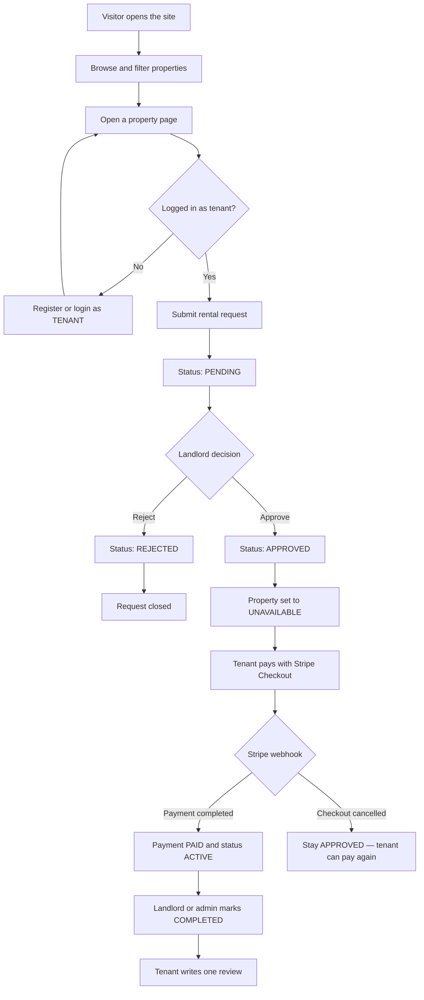
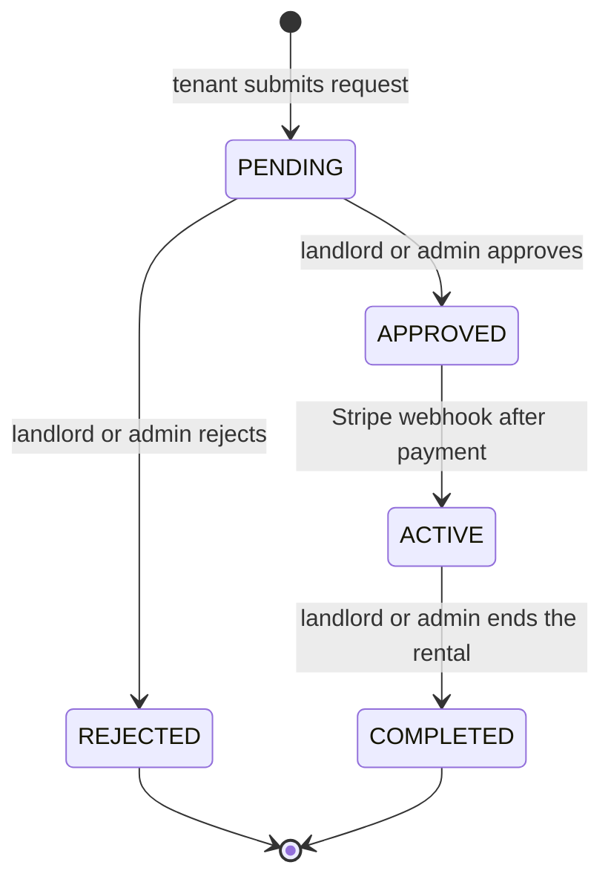
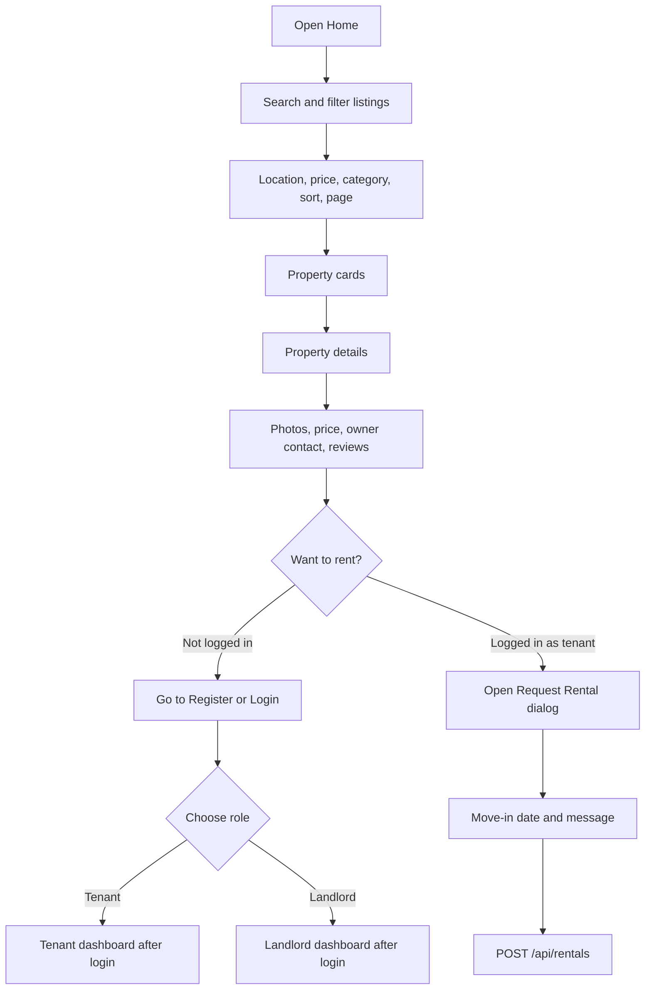
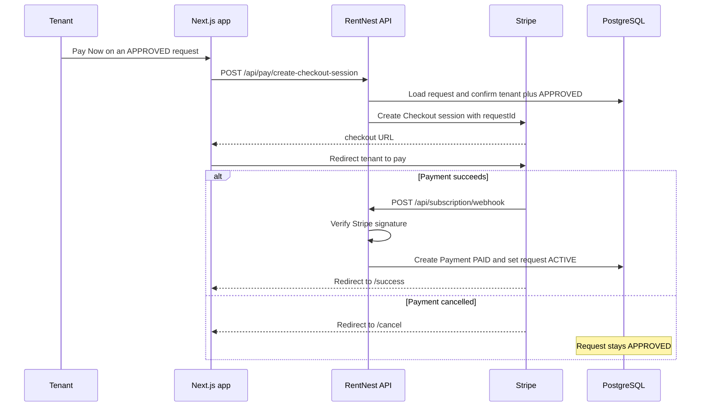
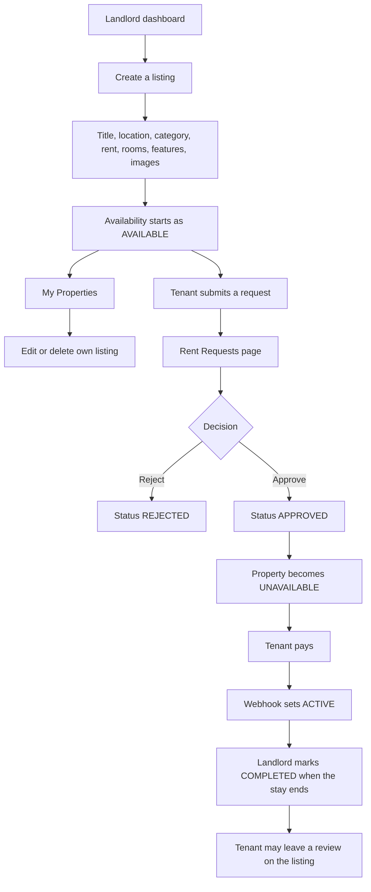
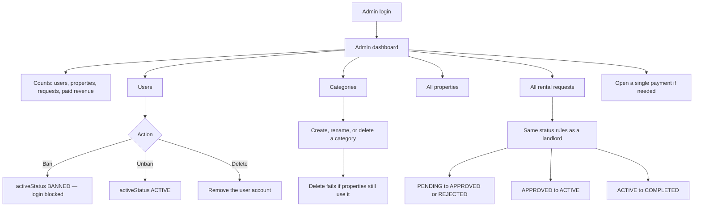
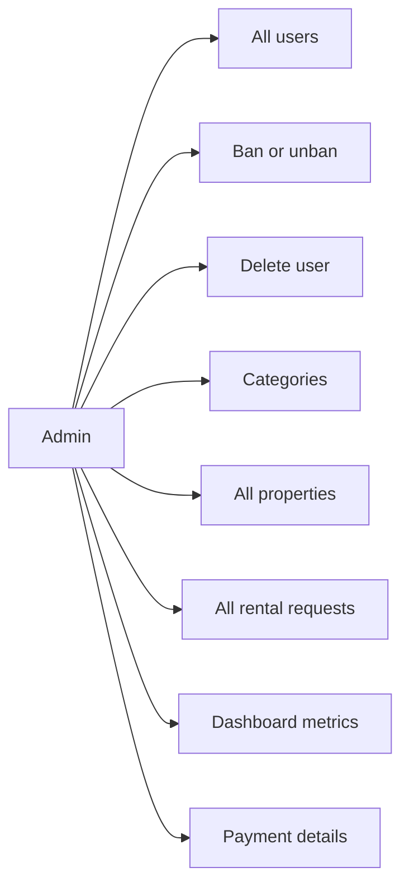
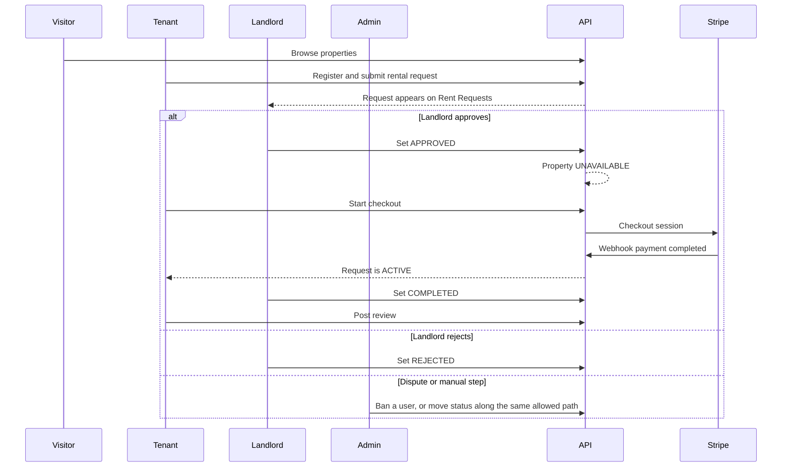
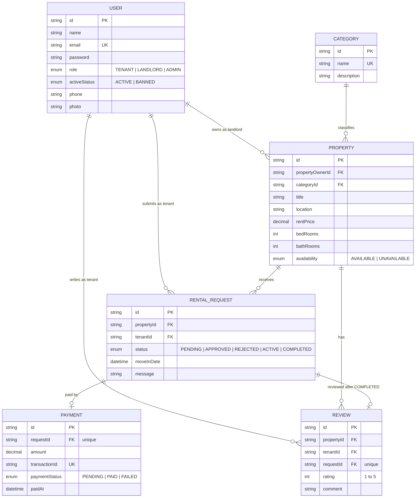
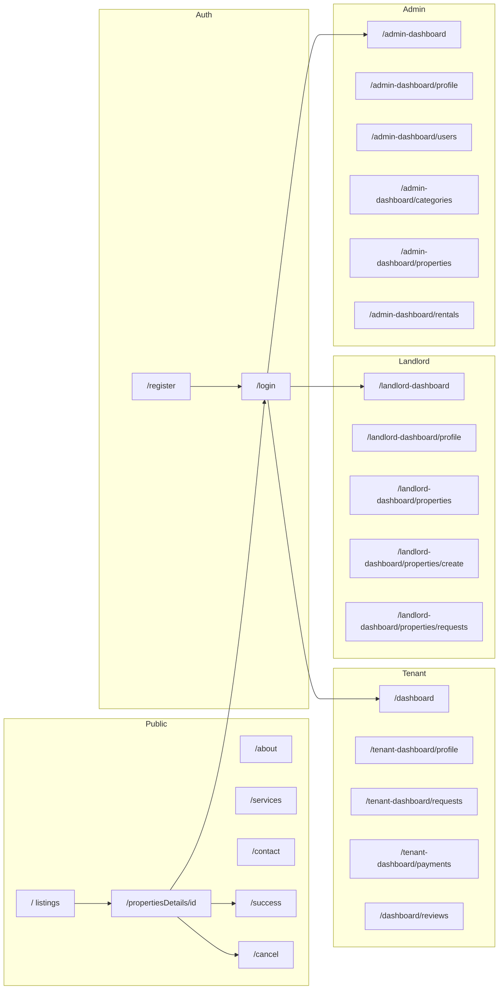

# RentNest — Full Workflow

RentNest is a rental marketplace. Visitors browse listings. A **tenant** requests a property, a **landlord** approves or rejects it, the tenant pays with Stripe, and an **admin** moderates users, categories, listings, and requests.

Roles in the database: `TENANT`, `LANDLORD`, `ADMIN`.
Registration only allows `TENANT` or `LANDLORD`. Admin accounts are created directly in the database.

---

## 1. One-look system flow



---

## 2. Rental status machine

These are the only transitions the API allows (`ALLOWED_TRANSITIONS` in the rental service). `REJECTED` and `COMPLETED` cannot move again.



What each status means:

| Status | Meaning | Who moves it |
|---|---|---|
| `PENDING` | Request sent, waiting for a decision | Created by the tenant |
| `APPROVED` | Landlord accepted. Property is taken off the market | Landlord or admin |
| `REJECTED` | Landlord declined. Terminal | Landlord or admin |
| `ACTIVE` | Stripe payment recorded. Tenant is renting | Stripe webhook (`checkout.session.completed`) |
| `COMPLETED` | Rental finished. Review is now allowed | Landlord or admin |

Approving a request sets that property’s `availability` to `UNAVAILABLE`, so it cannot be requested again while the booking is open.

A tenant cannot submit a second request for the same property while one is already `PENDING`, `APPROVED`, or `ACTIVE`.

---

## 3. Public user flow

Anyone can use the public site without an account.

Pages: `/` (home and listings), `/propertiesDetails/[id]`, `/about`, `/services`, `/contact`, `/success`, `/cancel`.



Public property search uses `GET /api/properties` with `location`, `minPrice`, `maxPrice`, `category`, `sort` (`price_asc` / `price_desc`), `page`, and `limit`.

---

## 4. Shared account flow

Every logged-in person shares the same account steps. The navbar then sends them to the dashboard that matches their role.

```mermaid
flowchart TD
    A[Register] --> B{Role}
    B -- TENANT or LANDLORD --> C[Password hashed, user ACTIVE]
    B -- ADMIN --> X[Rejected — admin cannot self-register]
    C --> D[Login with email and password]
    D --> E{Account banned?}
    E -- Yes --> F[Login blocked]
    E -- No --> G[Access token and refresh token cookies]
    G --> H{Role}
    H -- TENANT --> I[/dashboard]
    H -- LANDLORD --> J[/landlord-dashboard]
    H -- ADMIN --> K[/admin-dashboard]
    G --> L[GET /api/users/me]
    L --> M[Update own name, email, phone, or password]
    G --> N[Access token expired]
    N --> O[POST /api/auth/refresh-token]
    O --> G
    G --> P[Logout clears cookies]
```

Dashboard pages require a valid session. If `GET /api/users/me` fails, the layout redirects to `/login`.

---

## 5. Tenant flow

Sidebar: Dashboard, Profile, My Requests, Payments, My Reviews, Rent a House.

```mermaid
flowchart TD
    A[Tenant dashboard /dashboard] --> B[Browse listings on Home]
    B --> C[Open property details]
    C --> D{Property AVAILABLE?}
    D -- No --> E[Request blocked]
    D -- Yes --> F{Already have PENDING, APPROVED, or ACTIVE request?}
    F -- Yes --> E
    F -- No --> G[Submit request: property, move-in date, message]
    G --> H[Status PENDING]
    H --> I[My Requests page]
    I --> J{Landlord response}
    J -- REJECTED --> K[Request closed — pick another property]
    J -- APPROVED --> L[Pay Now]
    L --> M[Stripe Checkout]
    M --> N{Result}
    N -- Cancel --> O[/cancel — still APPROVED]
    O --> L
    N -- Success --> P[/success]
    P --> Q[Webhook writes Payment PAID]
    Q --> R[Status becomes ACTIVE]
    R --> S[Payments page shows history]
    R --> T[Landlord or admin marks COMPLETED]
    T --> U[Write one review: rating 1 to 5]
    U --> V[My Reviews]
```

Tenant rules from the API:

- Can only pay a request that is `APPROVED` and that they submitted.
- Checkout amount is the property `rentPrice` in USD cents.
- A review is allowed only when the request is `COMPLETED`, the request belongs to that tenant, and that request has no review yet.
- One review per rental request, and one review per tenant per property.

### Tenant payment sequence



---

## 6. Landlord flow

The landlord is the property owner. Sidebar: Dashboard, Profile, My Properties, Add Property, Rent Requests.



A landlord only sees requests for properties they own. Updating another landlord’s request fails the ownership check.

Landlord property routes:

| Action | Route |
|---|---|
| Create listing | `POST /api/properties/landlord` |
| Update own listing | `PUT /api/properties/landlord/:id` |
| Delete own listing | `DELETE /api/properties/landlord/:id` |
| List own listings | `GET /api/properties/my-properties` |
| Change request status | `PUT /api/rentals/:id/status` |

---

## 7. Admin flow

Admin accounts are not created from the register form. Sidebar: Dashboard, Profile, Users, Categories, All Properties, Rental Requests.



Admin dashboard numbers come from `GET /api/admin/dashboard`:

- Users: total, tenants, landlords
- Properties: total, available, rented (`UNAVAILABLE`)
- Requests: total, pending, approved
- Payments: count, and sum of amounts where status is `PAID`



---

## 8. How the three roles meet on one rental



---

## 9. Data model



---

## 10. Where each role can go

| Step | Public visitor | Tenant | Landlord | Admin |
|---|:---:|:---:|:---:|:---:|
| Browse and search listings | Yes | Yes | Yes | Yes |
| Register from the site | Yes, as tenant or landlord | — | — | No |
| Submit a rental request | No | Yes | No | No |
| Approve or reject a request | No | No | Own properties | Any request |
| Pay with Stripe | No | Own approved request | No | No |
| Mark a rental completed | No | No | Own properties | Any request |
| Write a review | No | After COMPLETED | No | No |
| Create and edit listings | No | No | Own listings | Can use landlord routes |
| Ban or delete users | No | No | No | Yes |
| Manage categories | No | No | No | Yes |
| See platform revenue | No | No | No | Yes |

---

## 11. Screen map



Open this file in a Markdown preview that supports Mermaid (Cursor, GitHub, or VS Code with a Mermaid extension) to see the diagrams rendered.
